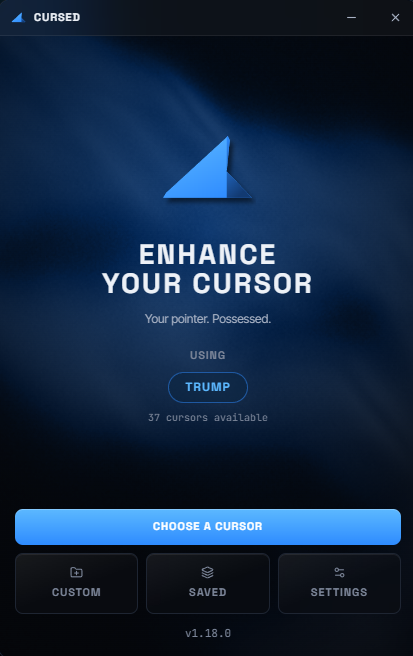
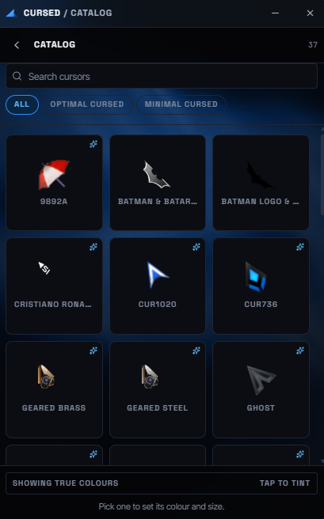
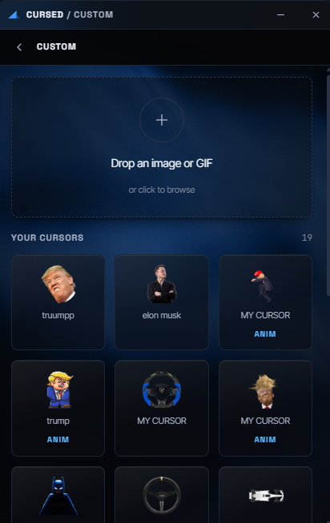
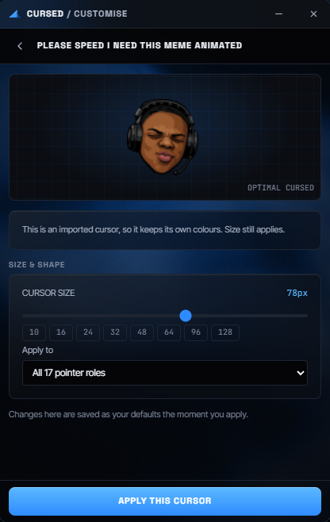

# Cursed

**Your pointer. Possessed.**

A ~10 MB Windows app that replaces every pointer role with a crisp,
multi-resolution cursor scheme, turns any image you drop on it into a real
`.cur` or `.ani`, and stops Windows quietly reverting it.

No administrator rights. No overlay. No added input latency.

| | |
| :---: | :---: |
|  |  |
| **Home** — what you're using now | **Catalog** — search, filter, hover to preview |
|  |  |
| **Custom** — drop an image, get a cursor | **Customise** — size, colour, which roles |

---

## Why

Changing a Windows cursor today means burrowing into Settings → Bluetooth &
devices → Mouse → Additional mouse settings → Pointers, and changing 17 roles
one at a time in a 1998-era file dialog. Third-party packs arrive as zips of
loose `.cur` files, replace only the arrow, ship a single 32×32 bitmap that
turns to mush at 150% DPI, and get wiped by the next theme change.

Cursed fixes all of that in one window.

## The one architectural rule

> **Cursed never draws a cursor. It only tells Windows which cursor to
> draw.**

The obvious approach — a transparent always-on-top window that tracks the mouse
and paints a sprite — is permanently laggy. It is composited by DWM at the
monitor's refresh interval, so it trails the real pointer by 8–33 ms forever, it
breaks in exclusive fullscreen, and it fights with games.

The Windows system cursor is drawn by the GPU's dedicated hardware cursor plane.
It updates at the mouse's polling rate with zero compositing latency, and it is
DPI-aware for free. So every cursor Cursed produces is a real `.cur` /
`.ani` file registered with Windows. Zero added input latency is not a target
here; it is a property of the design.

## What it does

- **36 hand-made cursor packs**, in the installer. Nothing is downloaded on
  first run and nothing needs importing.
- **All 17 pointer roles, always.** Most packs define an arrow and a hand; the
  remaining roles are filled from a plain built-in base, so you never end up
  with a custom pointer and a stock Windows hourglass the moment your PC copies
  a file.
- **Every size, sharp.** Vector artwork is rendered at 10, 16, 24, 32, 48, 64,
  96 and 128 px into one multi-resolution `.cur`, and photographs are sharpened
  in proportion to how far they were shrunk.
- **Any colour**, for the artwork that is ours — the base pack, the link hand
  and the text I-beam ship as greyscale masters and are tinted at apply time.
  Imported packs keep their own colours, because tinting somebody's finished
  artwork only breaks it.
- **Drop a PNG.** Hotspot picker with alpha-centroid and tip-detect, a 1:1
  preview of all eight sizes, and a real cursor in under three seconds. GIF and
  APNG become real animated `.ani` files.
- **Blend.** Your own arrow over a catalog pack for the other sixteen roles —
  the mode that makes one image into a coherent pointer set.
- **It stays.** A watchdog notices theme changes, personalisation resets and
  other cursor tools, and puts your scheme back.
- **One-click undo.** The original scheme is snapshotted before anything
  changes, and the uninstaller replays it automatically.

## Install

Download and double-click:

**[Cursed-Setup.exe](https://github.com/notfeylo/cursed/releases/latest/download/Cursed-Setup.exe)**
· [all releases](https://github.com/notfeylo/cursed/releases)
· [checksums](https://github.com/notfeylo/cursed/releases/latest/download/SHA256SUMS.txt)

That link always resolves to the newest release. It is deliberately not a
version-specific filename — the previous wording named a build five versions
old and stayed that way, because publishing a release does not edit prose.

Per-user install under `%LOCALAPPDATA%\Cursed` — **no UAC prompt**, no
terminal, no PowerShell.

Every install carries the full built-in cursor library. Nothing is downloaded on
first run and nothing needs importing.

### Which build

That link is x64, which is what almost every Windows PC is. The rest:

| Build | For |
| --- | --- |
| [x64](https://github.com/notfeylo/cursed/releases/latest/download/Cursed-Setup.exe) | Almost every PC |
| [ARM64](https://github.com/notfeylo/cursed/releases/latest/download/Cursed-Setup-ARM64.exe) | Snapdragon, Copilot+, Surface Pro X — native rather than emulated |
| [32-bit](https://github.com/notfeylo/cursed/releases/latest/download/Cursed-Setup-x86.exe) | Older PCs running 32-bit Windows, which cannot run the x64 build at all |
| [x64, offline](https://github.com/notfeylo/cursed/releases/latest/download/Cursed-Setup-Offline-x64.exe) | An air-gapped machine, or a network that blocks Microsoft's download |

The offline installer embeds the Edge WebView2 runtime, so it needs no network —
214 MB against the normal 11 MB. Take it only if you need it: WebView2 is
already on every Windows 11 and on any updated Windows 10, and the ordinary
installer simply uses what is there.

The app updates itself to the build it is already running, so an ARM64 install
keeps getting ARM64.

### Requirements

**Windows 10 version 1803 (build 17134) or newer**, or Windows 11.

That floor is not ours to move. Cursed's window is Edge WebView2; Microsoft
ended WebView2 support for Windows 7, 8 and 8.1, and the runtime will not
install there at all. The installer checks the build number and says so rather
than installing an app that would start, show no window and exit.

## Build from source

Needs Rust (stable, MSVC toolchain), Node 20+, and the Visual Studio C++ build
tools.

```bash
npm install
npm run tauri dev      # run it
npm run tauri build    # produces the NSIS .exe and .msi
```

Useful extras:

```bash
npm run generate:packs        # export the catalog's SVG masters to assets/packs
npm run check:bundle          # fonts, and no dev-only screen in a production build
npm run release               # every installer a release ships, into dist-release/

cd src-tauri                  # run cargo from here, not the root — see below
cargo test
cargo clippy --all-targets -- -D warnings
```

Cargo wants to be run from `src-tauri/`. Rustup picks a toolchain from the
*current directory*, and the pinned toolchain and its target list live in
`src-tauri/rust-toolchain.toml` — called from the repo root with
`--manifest-path` you silently get whatever `stable` is installed, and for a
cross-compile, one with no `std` for the target.

## Where the code lives

Each directory has a README explaining what is in it and where to start.

| | |
| --- | --- |
| [`src/`](src/) | **The front end.** React + TypeScript: screens, shared components, the typed IPC client, the store, and every design token in one stylesheet. |
| [`src-tauri/`](src-tauri/) | **The core.** Rust, and everything that touches Windows: the three cursor layers, the file writers, the catalog, updates, the tray, and the installer hooks. |
| [`assets/`](assets/) | The 36 bundled packs that ship inside the installer, and the generated artwork kept in-repo so a drawing change shows up as a picture in the diff. |
| [`website/`](website/) | cursorforge.vercel.app. Static HTML and CSS, no build step, and `script-src 'none'`. |
| [`scripts/`](scripts/) | Build, release and verification tooling. |
| [`docs/`](docs/) | Architecture, the cursor byte formats, licensing, and one verification record per release. |
| [`.github/`](.github/) | CI: the build, cross-architecture and audit jobs, and the tag-triggered release workflow. |

[docs/REPO_MAP.md](docs/REPO_MAP.md) is the same thing at file granularity, on
one screen.

## What it touches

| Location                            | What                                       |
| ----------------------------------- | ------------------------------------------ |
| `HKCU\Control Panel\Cursors`         | The 17 pointer roles and the scheme name   |
| `HKCU\Control Panel\Cursors\Schemes` | The named scheme, so it appears in Windows |
| `%APPDATA%\Cursed`              | Settings, presets, custom and cached cursors |

`HKEY_LOCAL_MACHINE` is never written. No driver, no service, no injected DLL,
no `SetWindowsHookEx`. See [SECURITY.md](SECURITY.md).

## Known limitations — stated honestly

1. **Apps that draw their own cursor are unaffected.** Many games using raw
   input, some remote-desktop sessions, and a few hardware-accelerated canvases
   render their own pointer. Overriding those needs process injection, which
   trips anti-cheat and AV heuristics. Cursed will not do it. This is an
   explicit non-goal.
2. **Cursor trails and click ripples need an overlay**, which the architecture
   rules out. Deferred, and if they ever ship it will be behind a clearly
   labelled "adds latency" toggle.
3. **Secure-desktop surfaces** — the UAC prompt, Ctrl+Alt+Del, the sign-in
   screen — always use the system defaults. Expected and correct.
4. **Animated cursors are capped at 60 frames and 4 seconds.** Beyond that the
   shell's own animation cost becomes visible.
5. **Windows only.** macOS has no supported system-cursor API at all.

## Documentation

- [REPO_MAP.md](docs/REPO_MAP.md) — where everything lives, one screen
- [ARCHITECTURE.md](docs/ARCHITECTURE.md) — how the three layers fit together
- [CURSOR_FORMAT.md](docs/CURSOR_FORMAT.md) — the `.cur` / `.ani` byte layouts
- [LICENSES.md](docs/LICENSES.md) — every bundled pack and font, and its licence
- [verification/](docs/verification/) — per release: what was checked, what was
  not, and what could not be
- [CONTRIBUTING.md](CONTRIBUTING.md) — the gate a change has to pass
- [TERMS.md](docs/TERMS.md) · [PRIVACY.md](docs/PRIVACY.md) — also rendered
  in-app, offline

## Privacy

Cursed collects nothing. No analytics, no telemetry, no account. The only
network request it can make is an update check against GitHub Releases, and it
can be turned off. See [PRIVACY.md](docs/PRIVACY.md).

## Licence

MIT — © 2026 feylo, for the application and for its own artwork: the mark, the
pointer, the link hand, the text I-beam and the `GAP-CROSS` blend base.

**The 36 bundled cursor packs are not covered by that.** Two are GPL-3.0 and
carry their own licence files; thirty-four state no licence at all, and several
depict characters owned by other people.
[docs/LICENSES.md](docs/LICENSES.md) names every one of them and explains the
position rather than leaving it to be discovered.

Cursed is not affiliated with, endorsed by, or sponsored by Microsoft.
